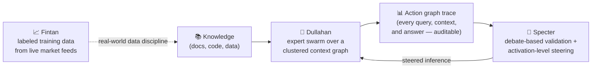

<div align="center">

# Mohammed Hamzah

### Building agentic systems that are **cheaper**, **friendlier**, and **lighter**.

[](https://www.linkedin.com/in/YOUR-LINKEDIN/)
[](mailto:your@email.com)
[](https://github.com/ForestDweller014)

</div>

---

## `> mission`

AI is getting more capable, but the default way we scale it — bigger models, bigger prompts, bigger GPU bills — doesn't hold up. The cost curve, the usability gap, and the energy footprint all point the same direction: **the next wave of agentic systems has to do more with less.**

I build toward that in three ways:

| | Principle | What it means in practice |
|---|---|---|
| 💸 | **Cheaper** | Route work to small, specialized models with tightly bounded context, instead of throwing one giant model and a giant prompt at every problem. |
| 🧭 | **Friendlier** | Every agent action should be inspectable — traces, graphs, and artifacts a human can actually read, audit, and replay. |
| 🌱 | **Lighter** | Fewer tokens, smaller models, controlled inference. Less compute per task is both an engineering win and a carbon win. |

Cornell '26 — Information Science + Applied Economics & Management. Currently building inference-side infrastructure for multi-agent systems and looking for **full-time AI/ML engineering roles** in inference and agent infrastructure.

```python
hamzah = {
    "education":  "Cornell University · Info Sci + AEM · Class of 2026",
    "focus":      ["agentic systems", "inference infrastructure", "interpretability"],
    "building":   ["multi-agent orchestration", "activation steering", "ML data pipelines"],
    "thesis":     "capable AI should get cheaper and lighter, not just bigger",
    "open_to":    "full-time AI/ML engineering roles",
}
```

---

## `> the_system`

My core projects aren't isolated demos — they form one pipeline. **Dullahan** runs swarms of small expert agents over a knowledge graph. Every run leaves behind a machine-readable action graph. **Specter** consumes that graph, puts each expert's answer on trial, and corrects the model *at the activation level* rather than by stuffing more text into the prompt. **Fintan** is the data discipline underneath: turning noisy real-world market data into clean, labeled training signal.



**Why this matters right now:** the industry is converging on exactly these problems — multi-agent orchestration, context engineering, small-model routing, and controllability beyond prompting. This stack is my attempt to build all four from first principles.

---

## `> featured_projects`

### 🐎 [Dullahan](https://github.com/ForestDweller014/Dullahan) — hierarchical agent swarm with reliable context control

**Plain English:** instead of asking one huge model one huge question, Dullahan breaks a task into small questions, hands each one to a small specialist agent that only sees the context it needs, and records every step so you can audit exactly what happened.

**Under the hood:** knowledge lives in a K-partitioned graph; a **Context Augmentation Layer (CAL)** builds token-budgeted context bundles per subquery from graph-backed retrieval (local vector index or PostgreSQL + pgvector); an **Expert Dispatch Layer (EDL)** routes each subquery to a cluster-specialized SLM via embedding attention. Experts recurse under hard depth/breadth/instance limits. Every run exports YAML/Markdown artifacts plus a JSON + Mermaid action graph.

**Why it's cheaper and lighter:** each step is a small model with a focused context slice — not a frontier model rereading the whole world. Context bundles record their own token-reduction stats per subquery.


---

### 👻 [Specter](https://github.com/ForestDweller014/Specter) — courtroom validation + activation-level steering for expert SLMs

**Plain English:** Specter checks an AI agent's work by staging a structured debate — prosecutor, defense, judge — over every answer it gave. Then, instead of just telling the model "do better" in text, it finds *where inside the network* the feedback matters and corrects the model there directly.

**Under the hood:** consumes Dullahan-style action graphs, runs multi-round debate over each answered node and delegation edge, then uses **TransformerLens** to localize debate feedback to specific residual-stream layer/token positions via contrast pairs. It derives steering vectors, materializes reversible activation hooks (`scaled_vector = direction × prosecution_strength × feedback_scale`), and reruns expert inference with the vectors injected — steering the computation instead of diluting the prompt.

**Why it matters:** prompt-based feedback competes with everything else in context. Activation steering is targeted, measurable, and doesn't grow the token bill. This is interpretability put to work as infrastructure.


---

### 📈 [Fintan](https://github.com/ForestDweller014/Fintan) — labeled ML training data from live US equity markets

**Plain English:** models are only as good as their data. Fintan turns raw, messy, minute-by-minute stock market data into clean, consistent training examples: "here's what the market looked like, and here's what the optimal trade decision would have been."

**Under the hood:** async, rate-limited fetching of 1-minute OHLCV bars for ~200 US equities from Alpaca, respecting NYSE calendars. Computes six scale-invariant features — RSI (Wilder smoothing), MACD histogram z-score, ATR, OBV, Bollinger %B/bandwidth via **Welford's online variance algorithm**, and Fibonacci range position. Labels each signal point by forward lookahead: optimal bracket and trailing-stop exit ratios, emitted as `{inputs, labels}` JSONL. Full CLI covers fetch, feature, label, and brokerage workflows.

**Why it matters:** numerically stable streaming statistics, honest labeling, and pipeline discipline — the unglamorous 80% of ML that determines whether the model on top is real.


---

## `> tech_stack`

**Languages**


**AI / ML**


**Agent & Inference Infrastructure**


**Tooling**


---

## `> currently`

```
[ ▰▰▰▰▰▰▱ ]  Dullahan + Specter integration      ·  validation-steered expert swarms
[ ▰▰▰▰▰▱▱ ]  Inference optimization              ·  small-model serving, context budgets
[ ▰▰▰▰▱▱▱ ]  Interpretability research           ·  activation steering as infrastructure
[ ▰▰▰▰▰▰▰ ]  Full-time AI/ML engineering search  ·  inference & agent infrastructure roles
```

---

<div align="center">


*Cheaper. Friendlier. Lighter. Get to work.*

</div>